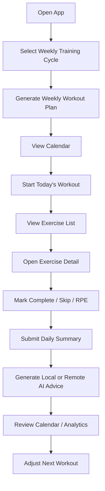

# Fitness AI App MVP Spec v1

Branch: `spec/fitness-mvp-v1`  
Repo: `qinze889/fitness-ai-app`  
Status: Draft for MVP implementation  
Last updated: 2026-06-20

## 1. Product Positioning

Fitness AI App is a personal Android fitness guidance app for one primary user. The MVP focuses on practical self-use rather than a public SaaS product.

The app combines workout scheduling, exercise guidance, diet planning, daily check-ins, simple analytics, and optional AI-assisted optimization. The core goal is to help the user complete weekly training consistently, record daily feedback, and receive actionable next-day adjustments.

## 2. MVP Goal

Build a usable Android MVP that supports:

1. Weekly workout plan setup.
2. Calendar-based workout schedule and local reminders.
3. Detailed exercise list for each training day.
4. Exercise detail pages with target muscles, effect explanation, steps, common mistakes, and safety notes.
5. Daily post-workout text summary input.
6. Local mock AI advice by default.
7. Optional remote AI advice through in-app provider configuration.
8. Basic diet plan and diet logging.
9. Simple data analysis and daily score.
10. Local-first data storage.

The MVP is for personal use first, so stability, clarity, and fast iteration are more important than complex social, payment, cloud, or multi-user features.

## 3. Target User

Primary user:

- Individual fitness beginner or intermediate trainee.
- Wants structured weekly plans such as 3-day or 4-day split training.
- Needs reminders, exercise explanations, and daily review.
- Wants AI-style suggestions to help adjust plans based on actual training feedback.
- Is comfortable manually entering optional remote AI provider settings inside the app if real AI advice is needed.

## 4. Core User Flow



## 5. MVP Scope

### 5.1 In Scope

#### Workout Planning

- User can choose weekly training frequency:
  - 3 days per week.
  - 4 days per week.
- User can choose training split:
  - Chest / Shoulder / Back.
  - Push / Pull / Legs can be added later, but is not required for first MVP.
- App generates a weekly plan with daily workout themes.
- Each workout day contains multiple exercises.

Example 4-day plan:

| Day | Theme | Example Exercises |
|---|---|---|
| Monday | Chest | Bench Press, Dumbbell Fly, Push-up |
| Tuesday | Back | Lat Pulldown, Seated Row, Dumbbell Row |
| Thursday | Shoulder | Shoulder Press, Lateral Raise, Rear Delt Fly |
| Saturday | Mixed / Weak Point | Chest Expansion, Core, Mobility |

#### Exercise Library

Each exercise should include:

- Exercise name.
- Target muscle group.
- Description.
- Training effect.
- Recommended sets and reps.
- Difficulty level.
- Step-by-step execution.
- Common mistakes.
- Safety notes.

Initial exercise list:

- Bench Press.
- Dumbbell Fly.
- Push-up.
- Chest Expansion / Cable Crossover equivalent.
- Shoulder Press.
- Lateral Raise.
- Rear Delt Fly.
- Lat Pulldown.
- Seated Row.
- Dumbbell Row.
- Plank.
- Squat or bodyweight squat as optional lower-body support.

#### Daily Workout Execution

For each exercise, user can record:

- Planned sets.
- Completed sets.
- Planned reps.
- Completed reps.
- Weight, optional.
- RPE / subjective difficulty, 1 to 10.
- Completion status:
  - Not started.
  - In progress.
  - Completed.
  - Skipped.

#### Daily Score

Each day should generate a simple training score from 0 to 100.

Recommended MVP scoring formula:

```text
Daily Score = Completion Score * 0.6 + Effort Score * 0.25 + Feedback Score * 0.15
```

Where:

- Completion Score: completed exercises / planned exercises * 100.
- Effort Score: average RPE normalized to 100.
- Feedback Score: 100 if user submits daily summary, otherwise 0.

The score is a habit and review indicator, not a medical or professional performance diagnosis.

#### Daily Summary

After workout, user can submit:

- Text summary.
- Voice summary can be postponed to MVP 1.1.

Minimum MVP requirement:

- Text input must be supported.
- Voice can be implemented using Android speech-to-text later if stable.

Prompt examples:

- “今天练得怎么样？”
- “哪些动作完成了？”
- “哪些动作没完成？为什么？”
- “身体感觉如何？酸痛、疲劳、状态？”
- “明天需要降低强度还是保持？”

#### AI Advice

AI advice is optional and local-first.

MVP must support:

1. Local mock AI advice without remote provider configuration.
2. Optional remote AI provider configuration inside the app.
3. DeepSeek / OpenAI-compatible provider settings with configurable base URL and model.
4. Graceful failure when network or provider request fails.

The selected AI advice generator should use structured daily data plus user summary and return:

- Today’s training review.
- Missed items analysis.
- Tomorrow adjustment suggestion.
- Recovery and rest reminder.
- Diet suggestion.
- Risk warning if fatigue or pain is mentioned.

AI output should be concise and actionable.

Remote AI configuration fields:

- Enable remote AI toggle.
- Provider: Local Mock / DeepSeek / OpenAI Compatible.
- Base URL.
- Model.
- Local credential input.
- Test connection.
- Clear credential.

Rules:

- App must work without remote AI.
- No custom backend server is required for MVP v1.
- Real credentials must not be hard-coded, committed, or logged.
- User summary and diet notes may be sent to the selected provider only when remote AI is enabled.

#### Calendar and Reminder

Calendar module should support:

- Weekly or monthly workout schedule view.
- Mark workout days.
- Show completed / partial / missed / rest status.
- Reminder time setting.
- Local notification reminder.

MVP reminder options:

- One daily reminder time per workout day.
- User can enable or disable reminders.

#### Diet Module

MVP diet module should support:

- Daily diet plan view.
- Basic meal categories:
  - Breakfast.
  - Lunch.
  - Dinner.
  - Snack.
- User can record simple text diet log.
- AI can provide lightweight diet adjustment suggestions through local mock or remote provider if configured.

No calorie database is required for MVP v1.

### 5.2 Out of Scope

The following should not be built in MVP v1:

- Public user registration and multi-user SaaS account system.
- Paid subscription.
- Social sharing.
- Complex wearable device integration.
- Full calorie database.
- Computer vision posture detection.
- Professional medical diagnosis.
- Cloud sync across multiple devices.
- Coach marketplace.
- Custom public backend service.

## 6. Suggested App Screens

### 6.1 Home Dashboard

Purpose: show today’s plan and current status.

Elements:

- Today’s training theme.
- Next reminder time.
- Daily score.
- Start workout button.
- Quick entry for daily summary.
- Latest AI advice preview or AI-not-configured state.

### 6.2 Today Workout Screen

Purpose: execute today’s workout.

Elements:

- Workout theme.
- Exercise cards.
- Sets and reps.
- Complete / Skip controls.
- RPE input.
- Finish workout button.

### 6.3 Exercise Detail Screen

Purpose: explain a movement clearly.

Elements:

- Target muscle.
- Training effect.
- Steps.
- Common mistakes.
- Safety notes.
- Default sets and reps.

### 6.4 Daily Check-in Screen

Purpose: collect feedback after training.

Elements:

- Text summary input.
- Quick prompt chips.
- Save summary button.
- Generate AI advice button.

### 6.5 AI Advice Screen

Purpose: show concise training optimization.

Elements:

- Today’s review.
- Risk notes.
- Next workout adjustment.
- Diet tip.
- Motivation.
- Configure AI action if remote provider is not configured.

### 6.6 Calendar Screen

Purpose: schedule and historical review.

Elements:

- Monthly or weekly calendar.
- Workout day markers.
- Planned / completed / partial / missed / rest states.
- Tap date to view plan and summary.

### 6.7 Diet Screen

Purpose: lightweight diet logging.

Elements:

- Today’s diet suggestion.
- Breakfast / lunch / dinner / snack input.
- Save diet log button.

### 6.8 Settings Screen

Purpose: configure local-first MVP.

Elements:

- Weekly plan type.
- Reminder settings.
- AI Settings entry point.
- Local data reset option if implemented.

### 6.9 AI Settings Screen

Purpose: configure optional remote AI.

Elements:

- Enable AI suggestions.
- Provider selector.
- Base URL.
- Model.
- Credential input.
- Test connection.
- Clear credential.
- Privacy note.

## 7. MVP Success Definition

MVP v1 succeeds when the user can:

1. Install and open a Debug APK.
2. Select or use a weekly workout plan.
3. View today’s workout.
4. Open exercise details.
5. Mark exercises completed or skipped.
6. Enter RPE.
7. Submit a daily summary.
8. Generate local mock AI advice without remote setup.
9. Optionally configure remote AI provider inside the app.
10. Log simple diet notes.
11. View calendar and basic progress.
12. Keep all core data after app restart.
