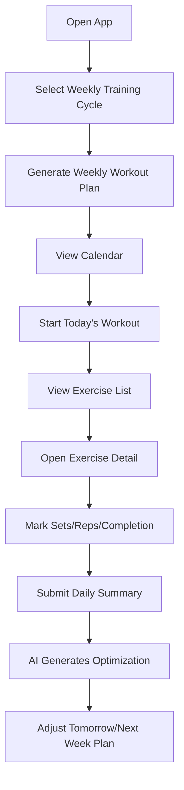

# Fitness AI App MVP Spec v1

Branch: `spec/fitness-mvp-v1`  
Repo: `qinze889/fitness-ai-app`  
Status: Draft for MVP implementation  
Last updated: 2026-06-20

## 1. Product Positioning

Fitness AI App is a personal Android fitness guidance app for one primary user. The MVP focuses on practical self-use rather than a public SaaS product.

The app combines workout scheduling, exercise guidance, diet planning, daily check-ins, and AI-assisted optimization. The core goal is to help the user complete weekly training consistently, record daily feedback, and receive actionable next-day adjustments.

## 2. MVP Goal

Build a usable Android MVP that supports:

1. Weekly workout plan setup.
2. Calendar-based workout schedule and reminders.
3. Detailed exercise list for each training day.
4. Exercise detail pages with target muscles, effect explanation, and completion state.
5. Daily post-workout text or voice summary input.
6. AI-generated daily optimization suggestions.
7. Basic diet plan and diet logging.
8. Local-first data storage, with optional backend/LLM API integration.

The MVP is for personal use first, so stability, clarity, and fast iteration are more important than complex social, payment, or multi-user features.

## 3. Target User

Primary user:

- Individual fitness beginner or intermediate trainee.
- Wants structured weekly plans such as 3-day or 4-day split training.
- Needs reminders, exercise explanations, and daily review.
- Wants an AI assistant to help adjust plans based on actual training feedback.

## 4. Core User Flow



## 5. MVP Scope

### 5.1 In Scope

#### Workout Planning

- User can choose weekly training frequency:
  - 3 days per week.
  - 4 days per week.
- User can choose training split:
  - Chest / Shoulder / Back.
  - Push / Pull / Legs can be added later, but is not required for first MVP.
- App generates a weekly plan with daily workout themes.
- Each workout day contains multiple exercises.

Example 4-day plan:

| Day | Theme | Example Exercises |
|---|---|---|
| Monday | Chest | Bench Press, Dumbbell Fly, Push-up |
| Tuesday | Back | Lat Pulldown, Seated Row, Dumbbell Row |
| Thursday | Shoulder | Shoulder Press, Lateral Raise, Rear Delt Fly |
| Saturday | Mixed / Weak Point | Chest Expansion, Core, Mobility |

#### Exercise Library

Each exercise should include:

- Exercise name.
- Target muscle group.
- Description.
- Training effect.
- Recommended sets and reps.
- Difficulty level.
- Common mistakes.
- Safety notes.

Initial exercise list:

- Bench Press.
- Dumbbell Fly.
- Push-up.
- Chest Expansion / Cable Crossover equivalent.
- Shoulder Press.
- Lateral Raise.
- Rear Delt Fly.
- Lat Pulldown.
- Seated Row.
- Dumbbell Row.
- Plank.
- Squat or bodyweight squat as optional lower-body support.

#### Daily Workout Execution

For each exercise, user can record:

- Planned sets.
- Completed sets.
- Planned reps.
- Completed reps.
- Weight, optional.
- RPE / subjective difficulty, 1 to 10.
- Completion status:
  - Not started.
  - In progress.
  - Completed.
  - Skipped.

#### Daily Score

Each day should generate a simple training score from 0 to 100.

Recommended MVP scoring formula:

```text
Daily Score = Completion Score * 0.6 + Effort Score * 0.25 + Feedback Score * 0.15
```

Where:

- Completion Score: completed exercises / planned exercises * 100.
- Effort Score: average RPE normalized to 100.
- Feedback Score: 100 if user submits daily summary, otherwise 0.

The score is a habit and review indicator, not a medical or professional performance diagnosis.

#### Daily Summary

After workout, user can submit:

- Text summary.
- Voice summary, if technically feasible in MVP.

Minimum MVP requirement:

- Text input must be supported.
- Voice can be implemented using Android speech-to-text if available, or postponed to MVP 1.1.

Prompt examples:

- “今天练得怎么样？”
- “哪些动作完成了？”
- “哪些动作没完成？为什么？”
- “身体感觉如何？酸痛、疲劳、状态？”
- “明天需要降低强度还是保持？”

#### AI Optimization

The app should send structured daily data plus user summary to an LLM and return:

- Today’s training review.
- Missed items analysis.
- Tomorrow adjustment suggestion.
- Recovery and rest reminder.
- Diet suggestion.
- Risk warning if fatigue or pain is mentioned.

AI output should be concise and actionable.

Example AI output structure:

```json
{
  "daily_review": "今天胸部训练完成度较高，但飞鸟动作未完成。",
  "risk_notes": ["如果肩前束疼痛，下一次卧推降低重量。"],
  "next_workout_adjustment": "下次胸部训练保留卧推，飞鸟减少一组。",
  "diet_tip": "训练后补充蛋白质和适量碳水。",
  "motivation": "保持连续记录，比单次高强度更重要。"
}
```

#### Calendar and Reminder

Calendar module should support:

- Weekly workout schedule view.
- Mark workout days.
- Show completed / missed status.
- Reminder time setting.
- Local notification reminder.

MVP reminder options:

- One daily reminder time per workout day.
- User can enable or disable reminders.

#### Diet Module

MVP diet module should support:

- Daily diet plan view.
- Basic meal categories:
  - Breakfast.
  - Lunch.
  - Dinner.
  - Snack.
- User can record simple text diet log.
- AI can provide lightweight diet adjustment suggestions.

No calorie database is required for MVP v1.

### 5.2 Out of Scope

The following should not be built in MVP v1:

- Public user registration and multi-user SaaS account system.
- Paid subscription.
- Social sharing.
- Complex wearable device integration.
- Full calorie database.
- Computer vision posture detection.
- Professional medical diagnosis.
- Cloud sync across multiple devices.
- Coach marketplace.

## 6. Suggested App Screens

### 6.1 Home Dashboard

Purpose: show today’s plan and current status.

Elements:

- Today’s training theme.
- Next reminder time.
- Daily score.
- Start workout button.
- Quick entry for daily summary.
- Latest AI suggestion card.

### 6.2 Calendar Screen

Purpose: schedule and historical review.

Elements:

- Monthly or weekly calendar.
- Workout day markers.
- Completion status.
- Missed day status.
- Tap a date to view plan and summary.

### 6.3 Workout Plan Screen

Purpose: configure and view weekly plan.

Elements:

- Weekly frequency selector.
- Split type selector.
- Generated workout days.
- Edit plan button, optional.

### 6.4 Workout Detail Screen

Purpose: execute today’s workout.

Elements:

- Exercise cards.
- Sets / reps / weight fields.
- Completion status.
- RPE selector.
- Finish workout button.

### 6.5 Exercise Detail Screen

Purpose: explain each action.

Elements:

- Exercise name.
- Target muscles.
- Effect explanation.
- Steps.
- Common mistakes.
- Safety notes.

### 6.6 Daily Review Screen

Purpose: collect user summary and show AI feedback.

Elements:

- Text input.
- Voice input placeholder or speech-to-text button.
- Submit to AI button.
- AI result card.

### 6.7 Diet Screen

Purpose: simple diet planning and logging.

Elements:

- Today’s diet suggestion.
- Meal text logs.
- AI diet tip.

### 6.8 Settings Screen

Purpose: configure reminders and AI API.

Elements:

- Reminder enabled.
- Reminder time.
- LLM provider setting.
- API key input, local storage only for MVP.
- Data reset/export button, optional.

## 7. Data Model

Recommended local-first schema.

### 7.1 WorkoutPlan

```ts
type WorkoutPlan = {
  id: string;
  name: string;
  weeklyFrequency: 3 | 4;
  splitType: "chest_shoulder_back" | "push_pull_legs";
  createdAt: string;
  updatedAt: string;
};
```

### 7.2 WorkoutDay

```ts
type WorkoutDay = {
  id: string;
  planId: string;
  date: string;
  theme: string;
  status: "planned" | "completed" | "missed" | "rest";
  score?: number;
};
```

### 7.3 Exercise

```ts
type Exercise = {
  id: string;
  name: string;
  muscleGroup: "chest" | "shoulder" | "back" | "core" | "legs";
  description: string;
  effect: string;
  steps: string[];
  commonMistakes: string[];
  safetyNotes: string[];
  defaultSets: number;
  defaultReps: string;
  difficulty: "beginner" | "intermediate" | "advanced";
};
```

### 7.4 WorkoutExerciseLog

```ts
type WorkoutExerciseLog = {
  id: string;
  workoutDayId: string;
  exerciseId: string;
  plannedSets: number;
  completedSets: number;
  plannedReps: string;
  completedReps?: string;
  weightKg?: number;
  rpe?: number;
  status: "not_started" | "in_progress" | "completed" | "skipped";
};
```

### 7.5 DailyReview

```ts
type DailyReview = {
  id: string;
  workoutDayId: string;
  textSummary: string;
  voiceTranscript?: string;
  aiReview?: string;
  aiRiskNotes?: string[];
  aiNextAdjustment?: string;
  aiDietTip?: string;
  createdAt: string;
};
```

### 7.6 DietLog

```ts
type DietLog = {
  id: string;
  date: string;
  breakfast?: string;
  lunch?: string;
  dinner?: string;
  snack?: string;
  aiSuggestion?: string;
};
```

## 8. AI Integration Spec

### 8.1 LLM Input

The app should send a structured payload:

```json
{
  "user_goal": "personal fitness consistency and muscle gain",
  "today_plan": {
    "theme": "Chest",
    "exercises": []
  },
  "today_logs": [],
  "daily_score": 82,
  "user_summary": "今天卧推完成了，飞鸟没做完，肩膀有点酸。",
  "diet_log": {
    "breakfast": "鸡蛋 牛奶",
    "lunch": "米饭 鸡胸肉",
    "dinner": "面条"
  }
}
```

### 8.2 LLM System Prompt

```text
你是一个个人健身计划助手。你的任务是根据用户当天训练计划、实际完成情况、主观反馈和饮食记录，生成简短、具体、可执行的训练优化建议。

要求：
1. 不做医疗诊断。
2. 如果用户提到疼痛、明显不适、头晕或受伤风险，优先提醒降低强度或休息。
3. 建议必须具体到动作、组数、强度或恢复方式。
4. 输出 JSON，字段包括 daily_review、risk_notes、next_workout_adjustment、diet_tip、motivation。
5. 每个字段尽量简短，不要长篇说教。
```

### 8.3 Error Handling

If AI API fails:

- Save the user summary locally.
- Show “AI 建议生成失败，可稍后重试”。
- Allow retry.
- Do not block workout completion.

## 9. Recommended Technical Architecture

The repository currently appears minimal, so the implementation can start with a clean Android-first structure.

Recommended stack for MVP:

- Android: Kotlin + Jetpack Compose.
- Local database: Room.
- Local key-value settings: DataStore.
- Notifications: Android WorkManager / AlarmManager plus notification channel.
- AI API: simple HTTP client layer, provider-agnostic.
- Optional backend: not required for MVP v1.

Alternative faster prototype stack:

- React Native / Expo if speed is more important than native Android integration.

Preferred MVP direction:

- Kotlin + Jetpack Compose if the goal is a real Android app.
- React Native if the goal is fastest visual prototype.

## 10. MVP Milestones

### Milestone 1: Project Skeleton

Acceptance criteria:

- Android project runs locally.
- Basic navigation works.
- Home, Calendar, Workout, Diet, Settings screens exist.

### Milestone 2: Workout Plan and Exercise Library

Acceptance criteria:

- User can select 3-day or 4-day weekly plan.
- App generates a plan.
- Exercise library seed data is available.
- Workout detail page shows planned exercises.

### Milestone 3: Workout Logging and Score

Acceptance criteria:

- User can mark exercises completed or skipped.
- User can enter sets, reps, weight, and RPE.
- App calculates daily score.
- Calendar reflects completed / missed status.

### Milestone 4: Daily Review and AI Optimization

Acceptance criteria:

- User can submit text summary.
- App sends structured payload to LLM.
- AI response is displayed and saved.
- API failure does not lose local data.

### Milestone 5: Diet and Reminder

Acceptance criteria:

- User can record simple meal logs.
- AI can generate diet suggestion.
- User can set workout reminder time.
- Local notification fires on workout days.

## 11. Acceptance Criteria for MVP v1

The MVP is considered complete when:

1. User can create a weekly workout plan.
2. User can view training days in calendar.
3. User can open today’s workout and see exercises.
4. User can open exercise detail and understand the action/effect.
5. User can record completion and RPE.
6. App calculates a daily score.
7. User can write a daily summary.
8. AI returns a practical optimization suggestion.
9. User can record simple diet text.
10. User can configure workout reminders.
11. All core data persists locally after app restart.

## 12. Implementation Notes for Codex

When implementing this spec:

1. Start with project skeleton and navigation.
2. Keep UI simple but clean.
3. Use seed data for exercises instead of building a complex admin system.
4. Keep AI provider abstract so the API layer can later switch between OpenAI-compatible, DeepSeek-compatible, or local services.
5. Do not overbuild authentication or cloud sync in MVP v1.
6. Prioritize local persistence and daily workflow completion.

## 13. Open Questions

These can be decided during implementation:

1. Native Android or React Native final choice.
2. Whether voice input is implemented in MVP v1 or MVP 1.1.
3. Whether API key is entered manually in app settings or injected during build.
4. Whether diet suggestions should be rule-based before AI integration is ready.
5. Whether the initial workout split should only support Chest / Shoulder / Back or include Push / Pull / Legs.
